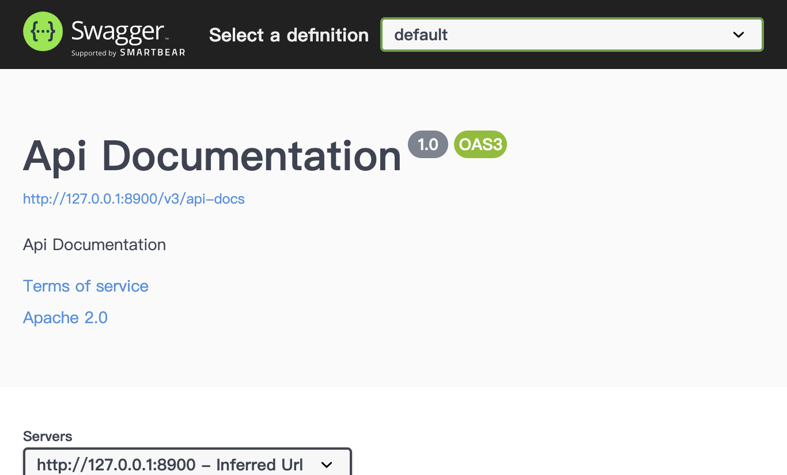

# StarTraining — Swagger / api-docs 未授权暴露 (ST-VULN-003)

| 项 | 内容 |
|----|------|
| Vendor | zhistaredu |
| Product | StarTraining（职星学院） |
| Version | 3.8.1 |
| Type | Security Misconfiguration |
| CWE | CWE-306 / CWE-200 |
| 认证 | None |
| 严重度 | High |

## 说明

Swagger UI 和 /v3/api-docs 匿名可访问，整站接口一目了然。

## 根因

SecurityConfig 把 swagger 路径加进了匿名白名单。

## 利用链接 / 复现

浏览器直接开（匿名）：

- [http://127.0.0.1:8900/swagger-ui/index.html](http://127.0.0.1:8900/swagger-ui/index.html)
- [http://127.0.0.1:8900/v3/api-docs](http://127.0.0.1:8900/v3/api-docs)


## 请求包（Yakit）

```http
GET /swagger-ui/index.html HTTP/1.1
Host: 127.0.0.1:8900
Connection: close

---
GET /v3/api-docs HTTP/1.1
Host: 127.0.0.1:8900
Connection: close
```

期望：打开 swagger-ui 能看到 Api Documentation；api-docs 返回 OpenAPI JSON。

## 截图



## 影响

攻击面枚举成本接近为零。

## 修复

生产关掉 swagger，或者挂到管理鉴权后面。

## 关联

- 本地报告：`../POC_VERIFICATION_REPORT.md`
- 脚本：`poc_verify/startraining_poc_verify.py` / `startraining_jwt_forge.py`
