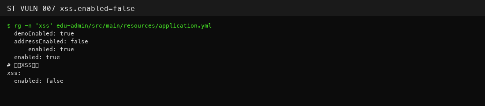

# StarTraining — Global XSS filter disabled (ST-VULN-007)

| Field | Value |
|-------|-------|
| Vendor | zhistaredu |
| Product | StarTraining |
| Version | 3.8.1 |
| Type | Cross Site Scripting |
| CWE | CWE-79 |
| Authentication | N/A (defense-in-depth) |
| Severity | Medium |

## Summary

`application.yml` sets `xss.enabled: false`, disabling servlet XSS filter.

## Root cause

Misconfiguration of xss filter switch.

## Exploit / reproduction

Config only (not a standalone endpoint):

- File: `edu-admin/src/main/resources/application.yml`
- Key: `xss.enabled: false`

Pairs with ST-VULN-006 for stored XSS. Related admin API example:

- `http://127.0.0.1:8900/system/notice/list` (requires token)


## PoC (Yakit)

```http
# Code/config verification — POST notice/content endpoints accept raw HTML when filter off
GET /system/notice/list HTTP/1.1
Host: 127.0.0.1:8900
Authorization: USER_TOKEN
Connection: close
```

Expected: Config shows xss.enabled=false; stored XSS easier on notice fields

## Screenshots



## Impact

Increases XSS impact across /system/* endpoints.

## Remediation

Set xss.enabled=true in production.

## References

- Local report: `../POC_VERIFICATION_REPORT.md`
- Scripts: `poc_verify/startraining_poc_verify.py`, `startraining_jwt_forge.py`
